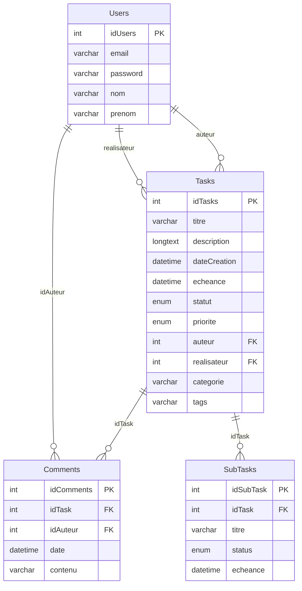

```mermaid
erDiagram
    Users {
        int idUsers PK
        varchar email
        varchar password
        varchar nom
        varchar prenom
    }

    Tasks {
        int idTasks PK
        varchar titre
        longtext description
        datetime dateCreation
        datetime echeance
        enum statut
        enum priorite
        int auteur FK
        int realisateur FK
        varchar categorie
        varchar tags
    }

    Comments {
        int idComments PK
        int idTask FK
        int idAuteur FK
        datetime date
        varchar contenu
    }

    SubTasks {
        int idSubTask PK
        int idTask FK
        varchar titre
        enum status
        datetime echeance
    }

    Users ||--o{ Tasks : "auteur"
    Users ||--o{ Tasks : "realisateur"
    Tasks ||--o{ Comments : "idTask"
    Users ||--o{ Comments : "idAuteur"
    Tasks ||--o{ SubTasks : "idTask"
```